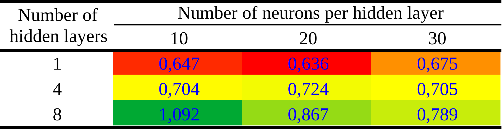

The following results are divided into 4 parts, in the last 3 the number of neurons per layer is fixed on the horizontal axis, and the vertical axis varies according to the number of layers and size of the dataset. In the first part the result is shown in the form of a graph rendered as a pseudo-colored image showing $t$, $x$ and $u(t,x)$ (visual evaluation of the PINN's predictive accuracy), and also a slice at time $t=0.5$. In the second part, the vertical axis is the number of layers (“Neurons x Layers” for simplicity), and in the third part it is the size of the dataset (“Neurons x Dataset” for simplicity). The fourth and final part shows the prediction time for some number of neurons per hidden layer and number of layers. The size of the dataset in some cases is called CP, meaning the same thing.

## 3.1. Visual assessment

A visual assessment of PINN's predictive accuracy is shown in \autoref{fig:bur1}, with time $t$ on the horizontal axis and spatial coordinate $x$ on the vertical axis. The color scale refers to the speed $u(x,t)$. The black marks on the graph represent 2,000 CPs randomly generated and used for training, and to obtain them $ \lambda_1 = 1 $ and $ \lambda_2 = 0.01/\pi $ were used. The network architecture used is composed of 4 hidden layers with 20 neurons each. The white solid vertical line at $t=0.5$ represents a specific snapshot shown in \autoref {fig:bur2}, which shows the overlapping solutions for PINN and GQM. For this specific result, the equation obtained by PINN is $u_t + 0.99958 u_x - 0.0032199 u_{xx} = 0$ whereas the equation used to obtain the training dataset is $u_t + u_x - 0.0031831 u_{xx} = 0$ . The network is able to identify the underlying partial differential equation with remarkable accuracy.

<figure id="fig:bur1">

<figcaption>
Figure 1. Predicted solution $u(t, x)$ along with the training data. The horizontal axis denotes time $t$, and the vertical axis, the coordinate $x$. The marks in the graph represent the randomly assigned CPs used for training. The color scale refers to the speed $u(t, x)$. The solid white vertical line refers to the snapshot $t=0.5$ shown in <a href=#fig:bur2>Figure 2</a>.
</figcaption>
</figure>

<figure id="fig:bur2">

<figcaption>
Figure 1. Superimposed solutions for PINN (in red) and numerical solution (in blue) for the $t=0.5$ snapshot.
</figcaption>
</figure>

## 3.2. Neurons x Layers

For the results presented below, the hyperparameters $N_{l}$ (number of hidden layers) and $N_{le}$ (number of neurons per hidden layer) were varied, as well as the number of CPs for training.
The \autoref{tab:resu1} shows the relative L2 errors and training times of the neural network, for different hyperparameters used: 10, 15, 20, 25, and 30 neurons per hidden layer, and 1, 2, 4, 6, and 8 hidden layers.
The number of CPs was set at 2,000.
All values shown here are the average of 3 runs.
In this table it is possible to observe that there is a tendency for the best values to be concentrated in the center, probably because there is a problem of underfitting or overfitting in the values at the edges of the table. One of the highlights is that the smallest error is obtained with 6 hidden layers, not 8. In this specific case, increasing the number of layers not only does not increase precision, but also worsens performance.

<!-- Markdown tables are too simple and not sufficient in this case. The best workflow is to create the complex table in LO Calc (burg-iden-tables.ods), copy (Ctrc-C/Ctrl-V) to LO Draw, and then export in SVG format. -->

<figure id="tab:resu1">

<figcaption>
<b>Table 1</b>. Relative L2 errors and DNN training times for different number of neurons and hidden layers. On the color scale, the best values are highlighted in red.
</figcaption>
</figure>

The [Figure 3](#fig:rlaygrapherror) shows that the error for 1 hidden layer is high compared to the other number of layers. For 2 layers there is a significant improvement in accuracy. For 4, 6, and 8 the gain in precision is not that great, but the curves are similar and are in the region of greater precision, showing that they would be the best choices.

<figure id="fig:rlaygrapherror">

<figcaption>
<b>Figure 3</b>. Relative L2 error (%) in function of number of neurons and hidden layers.
</figcaption>
</figure>

The [Figure 4](#fig:rlaygraptime) shows for 4 hidden layers, a tendency to describe a curve that resembles a parabolic, with a minimum processing time of 20 neurons per hidden layer. This is probably due to the problem of underfitting and overfitting occurring at the beginning and at the end of the curve.

<figure id="fig:rlaygraphtime">

<figcaption>
<b>Figure 4</b>. Processing times (seconds) in function of number of neurons and hidden layers.
</figcaption>
</figure>

## 3.3. Neurons x Dataset

The table \autoref{tab:rnu8error2} shows the relative L2 errors and training times of the neural network, for different hyperparameters and number of CPs used: 10, 15, 20, 25, and 30 neurons per hidden layer, and 400, 800, 1200, 1600, and 2000 CPs.
The number of layers was set at 8.
All values shown here are the average of 3 runs.
In this table, as in the previous one, it is possible to observe that there is a tendency for the best values to be concentrated in the center, probably because the problem of underfitting or overfitting is occurring in the values at the edges of the table. One of the highlights is that considering the smallest error and the shortest processing time, the best dataset size is 1600, and the best number of neurons per hidden layer is 20.

<figure id="fig:rnu8error">

<figcaption>
<b>Table 2</b>. Relative L2 errors and DNN training times for different number of neurons and dataset size. The number of hidden layers is set to 8. On the color scale, the best values are highlighted in red.
</figcaption>
</figure>

The \autoref{fig:rnu8grapherror2} shows that the error for 400 CPs is high compared to the others, 800 CPs presents a significant improvement in precision, and the other curves are relatively close, not presenting such a large accuracy gain.

<figure id="fig:rnu8grapherror">

<figcaption>
<b>Figure 5</b>. Relative L2 error (%) in function of number of neurons and dataset size. The number of hidden layers is set to 8.
</figcaption>
</figure>

The \autoref{fig:rnu8graphtime2} shows for most curves a tendency to describe a curve that resembles a parabolic, probably due to the problem of underfitting and overfitting occurring at the beginning and end of the curve. The shortest processing time occurs for 15 neurons per hidden layer, and 1600 CPs.

<figure id="fig:rnu8graphtime">

<figcaption>
<b>Figure 6</b>. Processing times (seconds) in function of number of neurons and dataset size. The number of hidden layers is set to 8.
</figcaption>
</figure>

## 3.4. Prediction time

The \autoref{tab:rpre} shows the neural network's prediction times, once training is complete. Times are for 10, 20, and 30 neurons per hidden layer, and 1, 4, and 8 layers. Most times are relatively close, around 0.7 seconds. Compared to the training time of about 43 seconds in the best cases, the time to predict the final result represents about 1.5\% of the training time, relatively. The difference is very large, and shows that we should look for algorithms or solutions where the number of trainings is smaller than the number of predictions, when  applicable.

<figure id="fig:rpre">

<figcaption>
<b>Table 3</b>. Prediction times for different number of neurons and hidden layers. On the color scale, the best values are highlighted in red.
</figcaption>
</figure>
